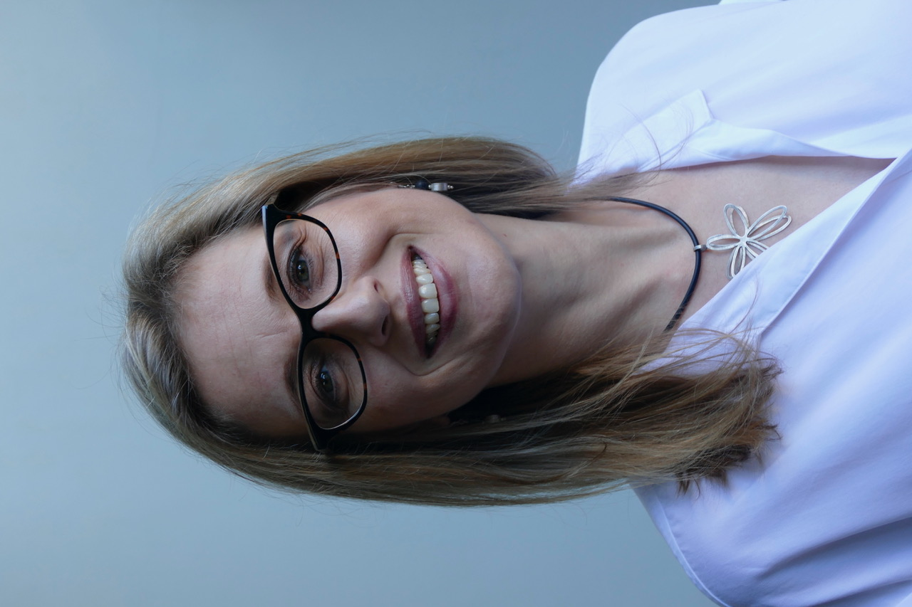

<video width="640" height="480" controls>
  <source src="http://www.sigplan.org/sites/default/files/cares-intro.mp4" type="video/mp4">
  <source src="http://www.sigplan.org/sites/default/files/cares-intro.ogv" type="video/ogv">
  <source src="http://www.sigplan.org/sites/default/files/cares-intro.webm" type="video/webm">
  Your browser does not support the video tag.
</video>

### Purpose of SIGPLAN CARES 

SIGPLAN CARES is a subcommittee of SIGPLAN.
ACM as an organization is governed by its

* [Code of Ethics and Professional Conduct][acm-ethics]

All SIG events and communications abide by

* ACM’s [policy against discrimination and harassment][acm-disc]. 

All SIG publications abide by

* ACM’s policy on [plagiarism, misrepresentation, and falsification][acm-plag];
* ACM's policy on [coercion and abuse in the ACM publications process][acm-abuse]; and
* ACM's policy on [roles and responsibilities in ACM publishing][acm-roles].

[acm-ethics]: https://www.acm.org/code-of-ethics
[acm-disc]: https://www.acm.org/diversity-inclusion/stop-harassment
[acm-plag]: https://www.acm.org/publications/policies/plagiarism-overview
[acm-abuse]: https://www.acm.org/publications/policies/coercion-and-abuse
[acm-roles]: https://www.acm.org/publications/policies/roles-and-responsibilities

If a violation of any of these policies occur, ACM urges reporting the incident to the event chair or to ACM leadership, as indicated on those webpages. You may also report violations using the following forms:

* Report an ethics violation [here](https://services.acm.org/ethics/report.cfm).
* Report harassment, discrimination, intimidation, or violence [here](https://services.acm.org/harass/harassForm.cfm).
* Report a policy violation such as a conflict of interest violation, coercion, abuse, misrepresentation, plagiarism, falsification or abuse of publication process [here](https://services.acm.org/policy_violations/policy.cfm).

We recognize that reporting to a conference chair or an upper level ACM administrator can be intimidating, especially in the face of an already unpleasant experience. We have therefore established CARES: Committee to Aid REporting on discrimination, harassment, and related ethical policy violations.

The role of CARES is to serve as a resource comprising of well-known and respected people in the programming languages community who are approachable and willing to listen to and help people who experience or witness discrimination, harassment, or other ethical policy violations either at our events or related to ACM publications; the committee members can be a sounding board for these people and can provide advice on the steps necessary to have the matter further investigated by ACM. It is important to understand that for the matter to be reported, the person experiencing the incident must still themselves send the complaint to ACM where it will be handled according to ACM’s policies. The CARES committee cannot serve as an intermediary in that official process and it cannot be involved in any aspect of the handling of the complaint by ACM.

The motivation in providing a standing CARES committee is: (1) people are more likely to report harassment, discrimination, or other ethical policy violations if familiar and respected members of the community are available for support, (2) unlike conference chairs, the members of the CARES committee will be chosen largely for their commitment and record on the targeted issues, (3) longer membership terms and an (eventually) established committee enable building experience and a record that inspires more trust for those considering coming forward about an incident, (4) committee members are expected to be physically present at our main events and work with event leaders to publicize their role, and (5) the presence of such a committee with respected and trusted members from the community assigned to watch for these issues should serve as a deterrent for behavior that violates the ACM code of conduct, as well as encourage us all to be aware of and speak up if we observe such behavior.

A [blog post](https://www.sigarch.org/sigarch-cares-to-report-on-discrimination-and-harassment/) 
provides background about the formation of the first CARES committee 
in the architecture community and [this blog post](https://www.sigarch.org/what-happens-to-us-does-not-happen-to-most-of-you/) talks about harassment some members 
of our community have experienced.  The [SIGARCH/SIGMICRO CARES](https://www.sigarch.org/benefit/cares/) 
committee led to foundation of the SIGPLAN committee.

The SIGPLAN CARES Bylaws can be found [here](http://www.sigplan.org/CaresBylaws). 

A collection of CARES resources can be found [here](https://www.sigarch.org/benefit/cares/cares-resources/).

### SIGPLAN CARES Operations

CARES members are always available by email to correspond and to set up a call with anyone who would like to speak with us about harassment, discrimination, or other concerns related to building and sustaining an inclusive research community. 

In addition, one or more CARES members will “cover” conferences by announcing their presence at the beginning of the meeting and at the business meeting, and being available for in-person conversations throughout the meeting at sessions and breaks, etc. A CARES member will be available for email and phone calls for on-line PC meetings and in person at physical PC meetings. We will announce the CARES members attending below. At conferences, we will typically set up a table for at least an hour a day and announce the time and location. Initially, the following conferences will have guaranteed coverage.

- ICFP
- PLDI
- POPL
- SPLASH

CARES committee members may also attend other workshops and conferences sponsored or co-sponsored by SIGPLAN, when they normally would attend. As the sponsoring organizations and/or committee expands in membership, it may add conferences to the guaranteed list.

<table style="width:100%">
  <tr>
    <th><b>Conference/Meeting</b></th>
    <th><b>CARES member attendees</b></th>
 </tr>
   <tr>
    <td><a href="https://popl23.sigplan.org">POPL 2023 </a></td>
    <td>Alexandra Silva, Sukyoung Ryu</td>
  </tr>
      <tr>
    <td><a href="https://2022.splashcon.org">SPLASH 2022 </a></td>
    <td>Gabriele Keller</td>
  </tr>
  <tr>
    <td><a href="https://pldi22.sigplan.org">PLDI 2022 </a></td>
    <td>Kathryn McKinley, Sukyoung Ryu</td>
  </tr>
  <tr>
    <td><a href="https://popl22.sigplan.org">POPL 2022</a></td>
    <td>Stephanie Weirich</td>
 </tr>
  <tr>
    <td><a href="https://2021.splashcon.org">SPLASH 2021</a></td>
    <td>Shriram Krishnamurthi, Stephanie Weirich, Alexandra Silva, Kathryn McKinley</td>
 </tr>
  <tr>
    <td><a href="https://icfp21.sigplan.org">ICFP 2021</a></td>
    <td>Stephanie Weirich, Simon Peyton Jones, Xinyu Feng, Sukyoung Ryu, Alexandra Silva</td>
 </tr>
  <tr>
    <td><a href="https://pldi21.sigplan.org/">PLDI 2021</a></td>
    <td>Kathryn McKinley, Vikram Adve, Peng Wu, Shriram Krishnamurthi, Stephanie Weirich, Xinyu Feng, and David Walker</td>
 </tr>
   <tr>
    <td><a href="https://asplos-conference.org/">ASPLOS 2021</a></td>
    <td>Vikram Adve</td>
 </tr>
  <tr>
    <td><a href="https://popl21.sigplan.org/">POPL 2021</a></td>
    <td>Shriram Krishnamurthi, Alexandra Silva, David Walker, Stephanie Weirich, Hongseok Yang</td>
 </tr>
   <tr>
    <td><a href="https://icfp20.sigplan.org/">ICFP 2020</a></td>
    <td>David Walker, Shriram Krishnamurthi, Stephanie Weirich, and Simon Peyton-Jones</td>
 </tr>
 <tr>
    <td><a href="https://pldi21.sigplan.org/">PLDI 2020</a></td>
    <td>Alexandra Silva, Vikram Adve, Michelle Stout, Kathryn McKinley, David Walker</td>
 </tr>
 <tr>
    <td><a href="https://2020.splashcon.org/">OOPSLA 2020</a></td>
    <td>Alexandra Silva, Shriram Krishnamurthi, Vikram Adve, Peng Wu, and Kathryn McKinley</td>
 </tr>
 <tr>
    <td><a href="https://ppopp20.sigplan.org/">HPCA/PPOPP/CGO 2020</a></td>
    <td>Peng Wu (<a href=".">SIGPLAN CARES</a>), Lieven Eeckhout and Timothy Pinkston (<a href="https://www.sigarch.org/benefit/cares/">SIGARCH/SIGMICRO CARES</a>)</td>
  </tr>
 <tr>
    <td><a href="https://icfp20.sigplan.org/">ICFP 2020</a> PC Meeting</td>
    <td>Shriram Krishnamurthi</td>
  </tr>
 <tr>
    <td><a href="https://pldi20.sigplan.org">PLDI 2020</a> PC Meeting</td>
    <td>Michelle Strout</td>
  </tr>
 <tr>
    <td><a href="https://popl20.sigplan.org/">POPL 2020</a></td>
    <td>David Walker, Alexandra Silva, and Hongseok Yang</td>
  </tr>
</table>

### SIGPLAN CARES Reports

### 2022:

TThis is the third annual report from the SIGPLAN CARES committee---a committee established to listen to and support folks in the programming languages community who experience or witness discrimination, harassment, or other violations of the ACM's code of conduct or ethics.

What CARES does.   CARES is dedicated to providing completely confidential support to members of the programming language community.  We listen to members who come to us for advice or who just want to talk. If they would like advice on what kinds of actions they can take, we do our best to provide such advice.  

Confidentiality.  When a person approaches a CARES member in confidence, that CARES member will not share any information about the situation with anyone else without that person's explicit permission, unless there is an imminent threat or danger of some kind.  Indeed, CARES members do not share the details of contacts made with other CARES members unless permitted.  

As a result, our annual reports are brief.  They do not contain details about the types of contacts that CARES members have made and they do not even contain specific numbers of contacts.  The reports are structured this way to protect the privacy of those that approach us.  

#### What happened in 2022

In 2022, individual SIGPLAN CARES committee members were contacted confidentially by between 5 and 15 community members throughout the year.  Such contacts sometimes led to extended conversations.  With more people coming back to conferences in person in 2022, It appears the need for SIGPLAN CARES has grown.

Members of the CARES committee represented CARES at four conferences in 2022, namely POPL 2022, PLDI 2022, ICFP 2022, and SPLASH 2022.  Attendance specifics are listed on the CARES website. The presence of CARES was advertised at the opening of the conference through the general chair’s presentation. 

We have received open, public feedback from a number of members of the community expressing the fact that they appreciate the creation of the committee---they view it as a sign that the programming languages community takes community climate and our code of conduct seriously.  The fact the committee has received confidential contacts is also evidence that the community would like mechanisms to discuss matters of harassment, discrimination, or ethics in private. 

### Older Reports

* [2021 Report](report2021)
* [2020 Report](report2020)

### SIGPLAN CARES Committee Members

<table style="width:100%" border="0">
  <tr>
   <td> <a href="http://cgi.cs.arizona.edu/~mstrout/">Michelle Strout</a> (she/her)</td>
   <td>Co-Chair, <a href="mailto:michelle.strout@hpe.com">michelle.strout@hpe.com</a>, HPE and University of Arizona </td>
  </tr> 
    <tr>
   <td> <a href="https://www.alexandrasilva.org/#/main.html">Alexandra Silva</a> (she/her)</td>
   <td>Co-Chair, <a href="mailto:alexandra.silva@cornell.edu">alexandra.silva@cornell.edu</a>, Cornell University</td>
  </tr> 
   <tr>
   <td> <a href="https://www.cs.princeton.edu/~dpw/">David Walker</a> (he/him)</td>
   <td> <a href="mailto:dpw@cs.princeton.edu">dpw@cs.princeton.edu</a>, Princeton University, 2019-2022 (co-chair) </td>
  </tr>
  <tr>
   <td> <a href="https://vikram.cs.illinois.edu/">Vikram Adve</a> (he/him)</td>
   <td>Member, <a href="mailto:vadve@illinois.edu">vadve@illinois.edu</a>, University of Illinois </td>
  </tr>
 <tr>
   <td> <a href="https://cs.nju.edu.cn/xyfeng/">Xinyu Feng</a></td>
   <td>Member, <a href="mailto:xyfeng@nju.edu.cn">xyfeng@nju.edu.cn</a>, Nanjing University </td>
  </tr> 
 <tr>
   <td> <a href="https://www.fos.kuis.kyoto-u.ac.jp/~igarashi/index.html.en">Atsushi Igarashi</a> (he/him)</td>
   <td>Member, <a href="mailto:igarashi@kuis.kyoto-u.ac.jp">igarashi@kuis.kyoto-u.ac.jp</a>, Kyoto University </td>
  </tr> 
 <tr>
   <td> <a href="https://www.uu.nl/staff/GKKeller">Gabriele Keller</a></td>
   <td>Member, <a href="mailto:g.k.keller@uu.nl">g.k.keller@uu.nl</a>, Utrecht University</td>
  </tr> 
 <tr>
   <td> <a href="https://cs.brown.edu/~sk/">Shriram Krishnamurthi</a> (he/him)</td>
   <td>Member, <a href="mailto:shriram@brown.edu">shriram@brown.edu</a>, Brown University </td>
  </tr> 
  <tr>
   <td> <a href="https://www.cs.utexas.edu/users/mckinley/">Kathryn McKinley</a> (she/her)</td>
   <td>Member, <a href="mailto:mckinley@cs.utexas.edu">mckinley@cs.utexas.edu</a>, Google</td>
  </tr> 
 <tr>
   <td> <a href="https://www.microsoft.com/en-us/research/people/simonpj/">Simon Peyton Jones</a> (he/him)</td>
   <td>Member, <a href="mailto:simon.peytonjones@gmail.com">simon.peytonjones@gmail.com</a>, Epic Games</td>
  </tr>
 <tr>
   <td> <a href="https://plrg.kaist.ac.kr/ryu">Sukyoung Ryu</a> (she/her)</td>
   <td>Member, <a href="mailto:sukyoung.ryu@gmail.com">sukyoung.ryu@gmail.com</a>, KAIST</td>
  </tr> 
 <tr>
   <td> <a href="https://www.cis.upenn.edu/~sweirich/">Stephanie Weirich</a> (she/her)</td>
   <td>Member, <a href="mailto:sweirich@cis.upenn.edu">sweirich@cis.upenn.edu</a>, University of Pennsylvania</td>
  </tr> 
 <tr>
   <td> <a href="https://pengwu.wordpress.com/">Peng Wu</a> (she/her)</td>
   <td>Member, <a href="mailto:pengwu@fb.com">pengwu@fb.com</a>, Facebook </td>
  </tr> 
 </table>  
